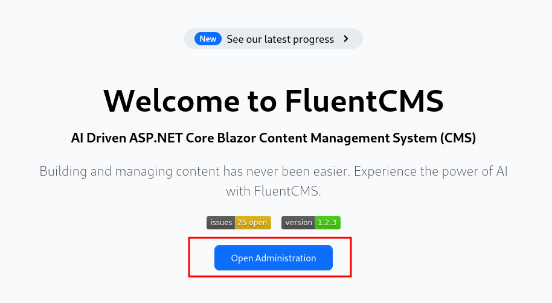
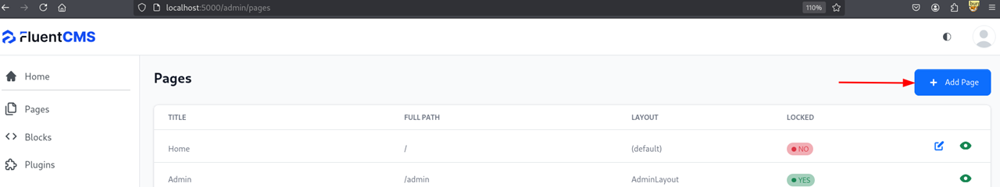
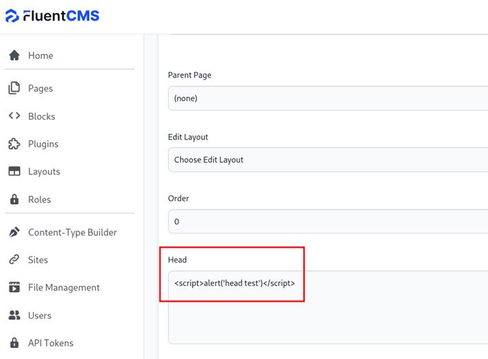

## Description:
A reflected cross-site scripting (XSS) vulnerability was identified in the admin page.
User input is not properly sanitized before being reflected in the HTTP response.

## Impact:
An attacker could craft a malicious URL that executes arbitrary JavaScript in the victim’s browser.

## Recommendation:
Implement proper input validation and output encoding on both frontend and backend.

## Note:
Detailed reproduction steps and screenshots have been shared with the maintainer privately.

---

1. Go to admin page

2. Click the Add Page button.

3. Write the scipt tag.

4. Check the XSS
