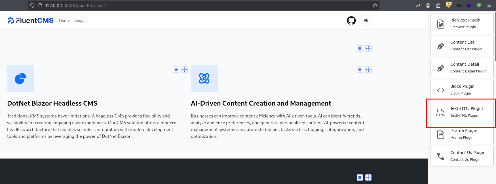
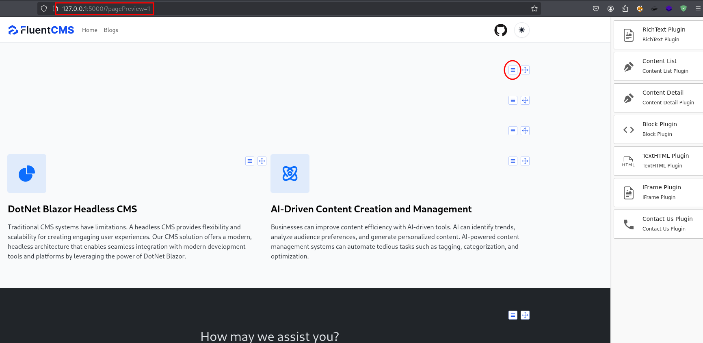
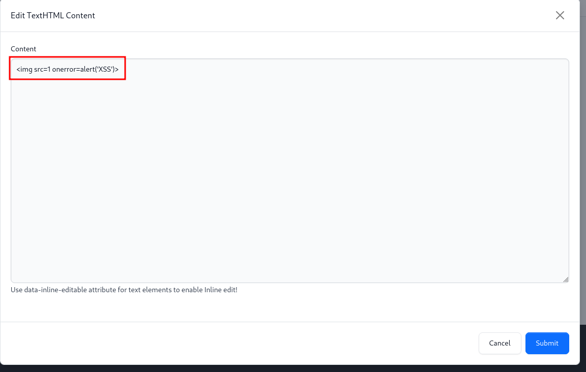
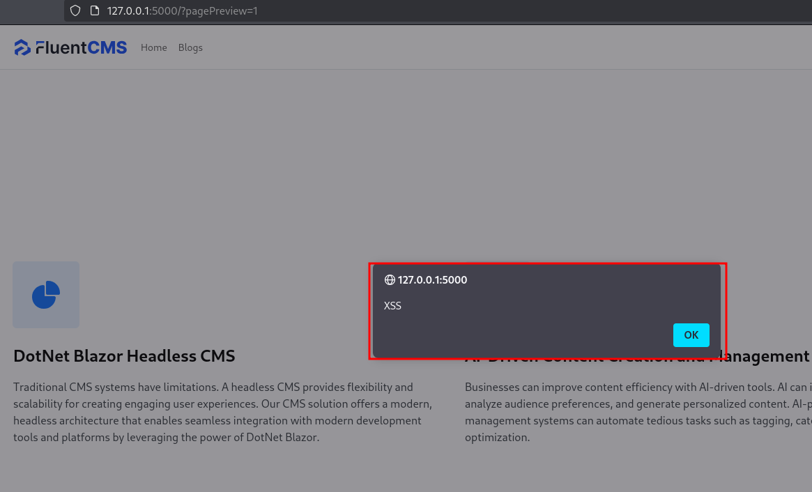

## Description:
A cross-site scripting (XSS) vulnerability was identified in the /pagepreview page.
User input is not properly sanitized before being reflected in the HTTP response.

## Impact:
An attacker could craft a malicious URL that executes arbitrary JavaScript in the victim’s browser.

## Affected version:
FluentCMS <= 0.0.5

## Recommendation:
Implement proper input validation and output encoding on both frontend and backend.

## Note:
Detailed reproduction steps and screenshots have been shared with the maintainer privately.

---

1. Access to `/?pagePreview=1` and select TextHTML plugin.

2. From the hamburger menu select edit button.

3. Insert payload and submit.

4. Refresh the page and check the script is triggered.

